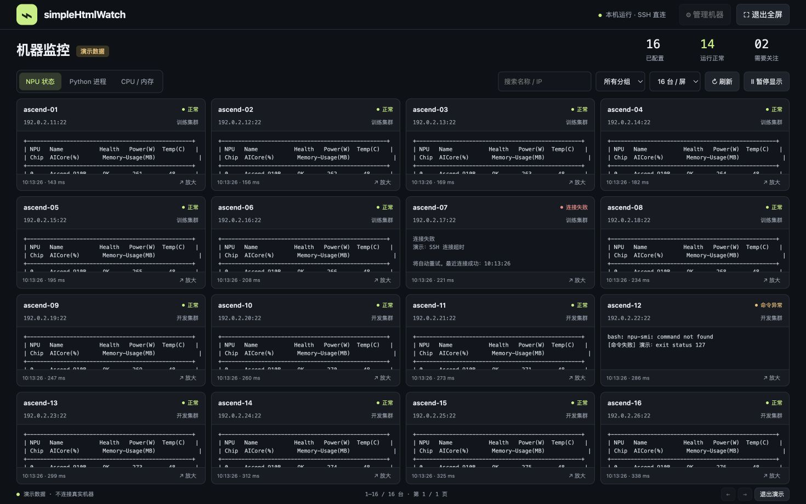

# simpleHtmlWatch

**把多个 SSH 终端，收进一个监控页面。**

面向裸机开发环境的轻量监控工具。下载一个程序，在自己的 Windows 电脑上双击运行，通过浏览器同时查看最多 **16 台机器**的 NPU 状态和 Python 进程。远端只需已有 SSH 服务和对应命令，无需安装 Agent、Prometheus 或其他监控组件。



## 开箱即用

1. 从 [Releases](https://github.com/Kirrito-k423/simpleHtmlWatch/releases/latest) 下载 `windows_amd64.zip`（普通 Intel / AMD Windows 电脑）；Windows ARM 设备选择 `windows_arm64.zip`。
2. 解压，双击 `simpleHtmlWatch.exe`，浏览器自动打开本机页面。**保留程序的控制台窗口，关闭它会停止采集。**
3. 点「管理机器」，新增共享凭据，例如 `实验室 root`，填写用户名 `root` 和密码。
4. 添加机器或批量粘贴 IP，让多台机器引用同一组凭据，然后保存。
5. 首次连接默认等待 **5 秒**后自动信任新主机密钥并开始采集，无需逐台点击。若需逐台确认，在「管理机器」中关闭「自动信任新主机密钥」。

运行时不需要安装 Python、Node.js、Go、Docker 或本机 SSH 客户端，不需要互联网。Windows 10/11 的现代浏览器（Edge、Chrome 等）即可。程序目前未做商业代码签名，下载的可执行文件可能触发 Windows SmartScreen；请核对下载来源和发布包校验值。macOS / Linux 也提供可执行包；macOS 包未签名、公证。

## 一个页面，最多 16 台

- **2 / 4 / 8 / 16 台布局**：宽屏下 16 台按 4 × 4 展示，窄屏自动降列；小屏幕可以滚动。
- **紧凑表头**：页面标题、统计和工具栏合为一行；机器名称、地址、分组、状态和放大按钮也合为一行。更新时间和采集耗时移至状态悬停提示，命令正文获得更多空间。
- **全屏**：右上角「全屏」进入，按 Esc 或「退出全屏」恢复。
- **单台放大**：卡片内点「放大」，查看完整输出并切换命令。
- **统一切换**：NPU 状态 / Python 进程 / CPU 与内存，一次切换所有卡片。
- **搜索、分组、分页**：最多配置 200 台机器，每页最多显示 16 台。后台会监控所有已启用机器，分页不停止采集。
- **共享凭据**：同一账号密码只填一次；修改一组凭据，引用它的机器全部更新。编辑时密码留空表示保持原值。
- **自动刷新**：默认 4 秒，允许 3–3600 秒；保持 SSH 连接，最多 8 台同时采集。一次采集完成后等待配置间隔，因此慢命令会延长实际刷新周期。
- **失败可见**：离线、密码错误、主机密钥变化、命令缺失分别显示；单台出错不阻塞其余机器。失败自动重试，不无限积累任务。
- **演示模式**：空页面点「体验 16 台演示」。所有地址、任务及读数均为虚构，不会连接任何机器。

「暂停显示」只暂停当前页面更新，后台仍继续采集；要停止某台机器的 SSH 活动，在设置中取消「启用监控」并保存。

## 默认监控命令

| 选项 | 远程命令 | 用途 |
| --- | --- | --- |
| NPU 状态 | `npu-smi info` | 保留厂商原始表格，不假设特定 NPU 型号或输出格式 |
| Python 进程 | `ps -ef \| awk 'NR == 1 \|\| /[pP][yY][tT][hH][oO][nN]/'` | 等价于常用 Python 任务筛选，不把 grep 自身显示成任务 |
| CPU / 内存 | `ps -eo user,pid,ppid,pcpu,pmem,rss,etime,args --sort=-pcpu \| awk 'NR == 1 \|\| /[p]ython/'` | 按 CPU 排序，显示 RSS、内存百分比和运行时长 |

不在远端启动 `watch`，由程序周期性执行命令，避免持久 `watch` 进程及终端控制字符。命令通过 `bash -o pipefail -lc` 执行，以加载常见裸机环境的 PATH。远端需要 Linux、Bash 和对应命令；CPU / 内存选项需要 GNU / procps 风格的 `ps`。无 NPU 的机器可以取消 NPU 选项。若 `npu-smi` 不在登录环境 PATH 中，需在远端正确配置 PATH。

每条命令超时 12 秒，连接超时 8 秒，SSH 握手超时 10 秒；单命令输出最多 256 KiB。界面展示原始输出，暂不解析型号专属指标、不保存历史曲线，也不提供任意命令执行、杀进程或交互终端。关闭 SSH 通道通常会终止这些短命令，但无法保证任意远端子进程都收到终止信号。

## 批量添加

先创建共享凭据，再选择「批量添加」。每行支持以下形式：

```text
192.0.2.11
训练机-02,192.0.2.12,训练集群
开发机-03,192.0.2.13:2222,开发集群
IPv6机器,[2001:db8::10]:22,开发集群
```

重复的 `IP + 端口` 会跳过。上述 IP 均为文档示例地址。可导出不含密码的 JSON 配置，在另一台电脑导入后重新填写密码；导出中仍有机器地址和用户名，请按内部信息管理。

## 本机配置与安全边界

页面内嵌在程序中，无 CDN、外部字体、遥测或云端服务。HTTP 仅监听 `127.0.0.1`，自动选取空闲端口；校验 Host、Origin 和每次启动生成的会话令牌。程序按共享凭据指定的用户执行固定监控命令，用户名可以是 root，也可以是有相应权限的普通用户。

配置目录默认是：

| 系统 | 目录 |
| --- | --- |
| Windows | `%AppData%\simpleHtmlWatch` |
| macOS | `~/Library/Application Support/simpleHtmlWatch` |
| Linux | `$XDG_CONFIG_HOME/simpleHtmlWatch`，未设置则 `~/.config/simpleHtmlWatch` |

- `config.enc`：AES-256-GCM 加密配置，包含机器和密码。
- `vault.key`：本机随机加密密钥。
- `known_hosts.json`：自动信任或手动确认过的 SSH 主机指纹。
- `app.lock`：防止多个实例同时修改同一配置目录；退出后锁由操作系统释放。

**加密密钥与配置同机保存，这是避免配置单独泄漏时暴露密码的基础保护，不是主密码保险库。能同时读取这两个文件的人可以解密密码。** Unix 文件权限为 0600；Windows 使用用户配置目录继承的 ACL，不使用 DPAPI。请勿把整个配置目录上传 GitHub、共享网盘或发给他人。备份或迁移时需同时保管 `config.enc` 和 `vault.key`，密钥丢失无法恢复密码。浏览器查询配置时不会得到已保存的密码；输入密码时只发给本机服务。

SSH 默认采用适用于受控内网调试的首次使用信任：第一次发现未知主机密钥后等待 5 秒，再次握手看到相同密钥时保存指纹，然后才发送密码；后续连接会校验已保存指纹。等待由本地程序执行，不需要浏览器保持打开，也不受刷新间隔限制。倒计时中指纹变化、或已保存机器的密钥变化，均不会自动接受，需要手动核对。可在「管理机器 → 首次连接」关闭自动信任；旧版配置升级时默认开启，用户明确关闭后的选择会持久保存。自动信任不核验新机器的身份，首次连接的安全性依赖内网本身可信。当前只支持 SSH 密码认证（含密码式 keyboard-interactive），不支持密钥、跳板机、MFA 问答或 SSH config。

## 命令行

```powershell
# 固定本机端口，不自动打开浏览器
.\simpleHtmlWatch.exe -port 8765 -no-browser

# 可携带模式：配置放在自己指定的目录
.\simpleHtmlWatch.exe -data-dir .\data

.\simpleHtmlWatch.exe -version
```

默认配置目录在用户账户下，升级时替换程序即可保留机器配置。网络需能直接访问目标机器的 SSH 端口，可通过现有 VPN 接入内部网络。

## 从源码构建

仅开发者需要 Go 1.26 或更新版本，终端用户下载发布包即可。前端是原生 HTML / CSS / JavaScript，不需要 npm 构建。

```sh
go test -race ./...
go vet ./...
go build -o simpleHtmlWatch .
./simpleHtmlWatch

# 交叉编译 Windows 单文件
CGO_ENABLED=0 GOOS=windows GOARCH=amd64 go build -trimpath -ldflags="-s -w" -o simpleHtmlWatch.exe .

# 六个平台的发布包，需要 bash / zip / tar / python3
bash scripts/build.sh v0.1.0
```

仓库 CI 在 Windows、macOS 和 Linux 上运行测试。推送 `v*` 标签会构建各平台发布包及 `SHA256SUMS`，并创建 GitHub Release。测试包括 16 台机器配置的模拟 SSH 采集、首次指纹确认、5 秒后自动信任及关闭选项、主机密钥变化拦截、会话复用、命令失败、超时、配置加密和 HTTP 访问边界。测试中的服务是本地 SSH fixture，不代替真实 Ascend 硬件验证。

## 结构

```text
main.go                 # 本机启动、嵌入网页、退出管理
internal/watch/         # SSH 采集、配置、指纹和 HTTP API
web/                    # 零构建依赖网页
scripts/build.sh        # 跨平台发布包
.github/workflows/      # 测试与自动发布
```

技术依据：[Go 嵌入资源](https://pkg.go.dev/embed)、[Go SSH 客户端](https://pkg.go.dev/golang.org/x/crypto/ssh)。

MIT License.
